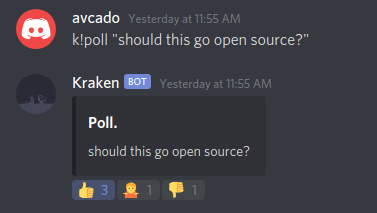

## Kraken Bot

An open source bot for Discord.

## What does it do?

This is an example of a poll that Kraken can make.

## How do I run it?

1. Make a discord bot in the discord developer portal
2. Create a file named, `tokenfile` and copy paste your bot token into it
3. Run `./run.sh`

## How do I use it?

Run k!help. It'll tell you everything there is to know about all of the commands.

## I hate github! do you have gitlab?

[Yes.](https://gitlab.com/Vresod/KrakenBot)
